# Prueba Técnica Accenture - Backend con Spring Boot y Java 17

Este proyecto es una API REST desarrollada en **Spring Boot** con Java 17 que permite gestionar una estructura de franquicias, sucursales y productos. Incluye persistencia en base de datos MySQL y puede ejecutarse en un contenedor Docker.

---

## Tecnologías Utilizadas

- Java 17
- Spring Boot
- Spring Data JPA
- MySQL
- Docker
- Maven

---

##  Configuración

En el archivo `application.properties` se definen los siguientes parámetros:

```properties
spring.application.name=PruebaTecnicaAccenture
spring.datasource.url=jdbc:mysql://host.docker.internal:3306/PruebaAcenture
spring.datasource.username=root
spring.datasource.password=123456
spring.datasource.driver-class-name=com.mysql.cj.jdbc.Driver
spring.jpa.database-platform=org.hibernate.dialect.MySQL8Dialect
spring.jpa.hibernate.ddl-auto=update
spring.jpa.show-sql=true
```

> Usa `host.docker.internal` para que tu contenedor Docker pueda acceder a la base de datos en tu máquina local (solo en Docker para Windows/Mac).

---

##  Docker

### Dockerfile

```dockerfile
# Usamos una imagen base de Java
FROM openjdk:17-jdk-slim

# Directorio de trabajo en el contenedor
WORKDIR /app

# Copiamos el JAR generado por Maven
COPY target/PruebaTecnicaAccenture-0.0.1-SNAPSHOT.jar app.jar

# Exponemos el puerto de la aplicación
EXPOSE 8080

# Ejecutamos la aplicación
ENTRYPOINT ["java", "-jar", "app.jar"]
```

### Comandos Docker

```bash
# Construir imagen
docker build -t prueba-accenture .

# Ejecutar contenedor con nombre y mapeo de puertos
docker run -d -p 8080:8080 --name prueba-accenture-app prueba-accenture
```

---

## Endpoints de la API

### FranquiciaController

- `POST /api/franquicias`: Crea una nueva franquicia.
- `POST /api/franquicias/{id}/sucursales`: Agrega una sucursal a una franquicia.
- `PUT /api/franquicias/{id}/nombre`: Actualiza el nombre de una franquicia.

### SucursalController

- `POST /api/sucursales/{id}/productos`: Agrega un producto a una sucursal.
- `DELETE /api/sucursales/{sucursalId}/productos/{productoId}`: Elimina un producto de una sucursal.
- `PUT /api/sucursales/{id}/nombre`: Actualiza el nombre de una sucursal.

### ProductoController

- `GET /api/productos/top-stock/{franquiciaId}`: Obtiene los productos con más stock en una franquicia.
- `GET /api/productos/top-por-sucursal/{franquiciaId}`: Top productos por sucursal de una franquicia.
- `PUT /api/productos/{id}/nombre`: Actualiza el nombre de un producto.
- `PUT /api/productos/{id}/stock?nuevoStock=X`: Actualiza el stock de un producto.

---

##  Uso con Postman

Asegúrate de que el contenedor esté corriendo con el puerto 8080 expuesto, y que tu base de datos esté disponible. Usa `http://localhost:8080` como base URL para probar los endpoints.

---

##  Autor

Frank Esteban Soto Paz
Prueba técnica para Accenture - Backend Java Developer

##  FUNCIONAMIENTO
### Crear BD y registrar una nueva franquicia.

Se corre el proyecto y crea las tablas segun las entidades 
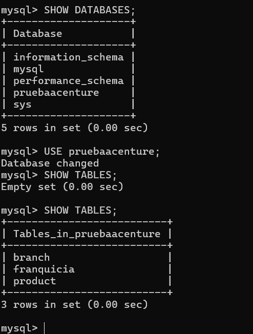

Se agrega por postman una franquicia: 
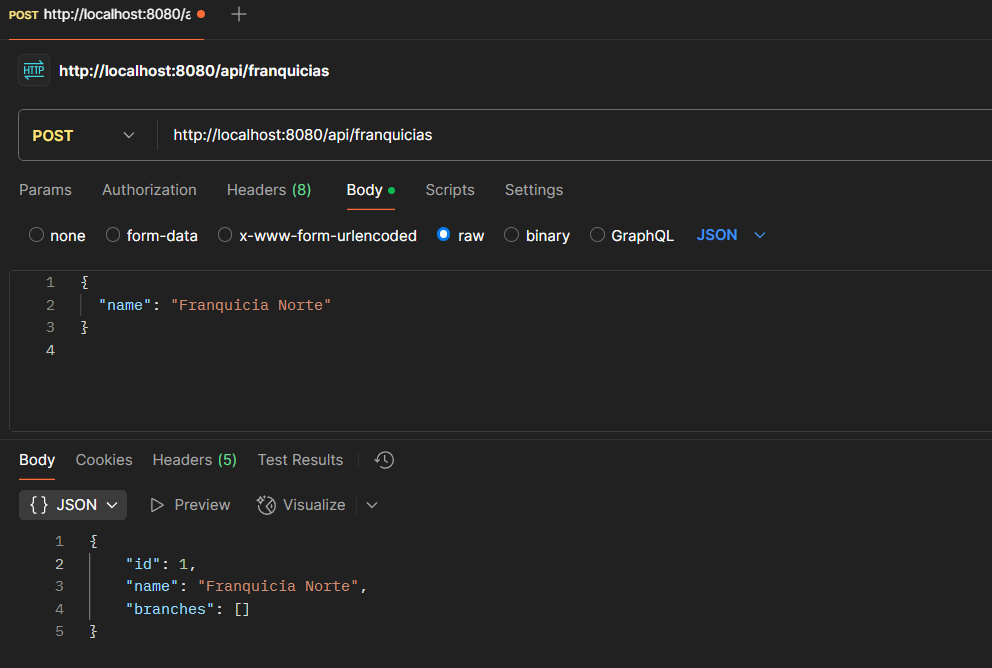

En Bd 
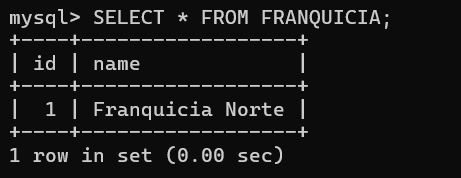

Se crea una surcursal 

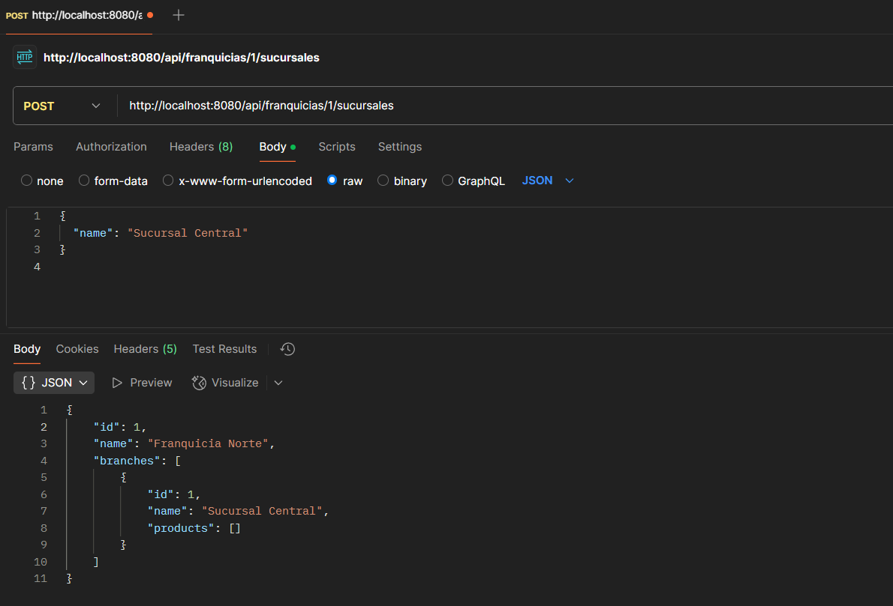

Se crea surcursal y Producto 
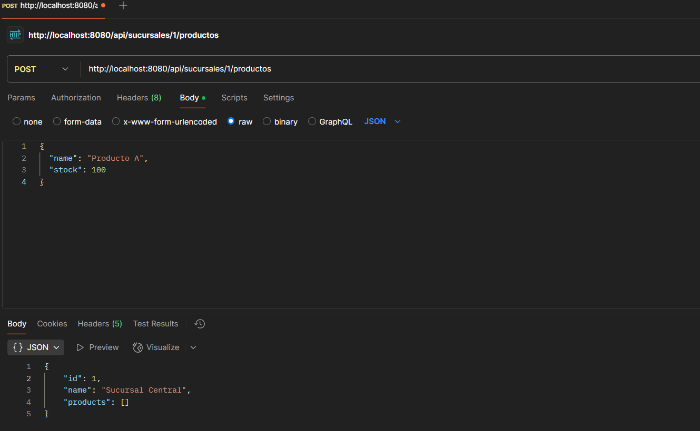

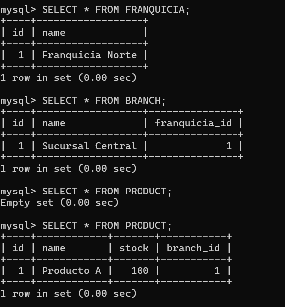

## Se realizan los actualizar franquicia surcursal y stock

Franquicia
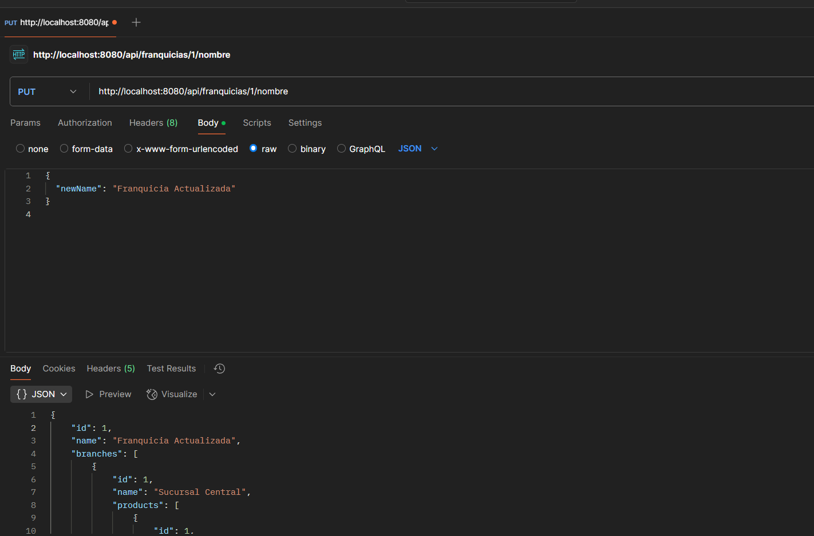

Surcursal 
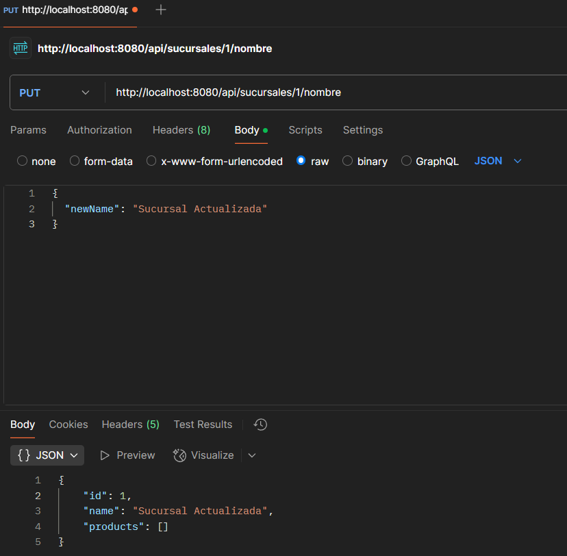


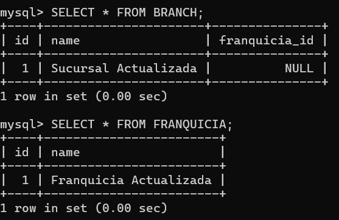

Stock
Se le envia 200 de stock nuevo 
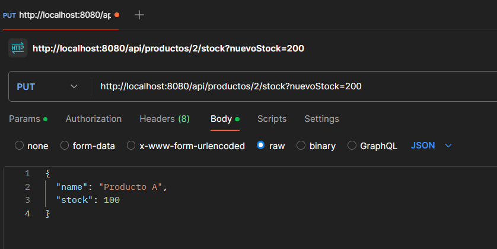

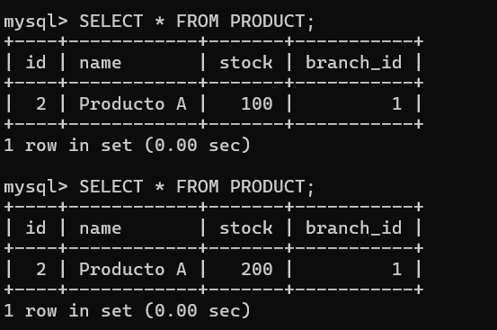

Se listan los productos con mas stock en surcursales 
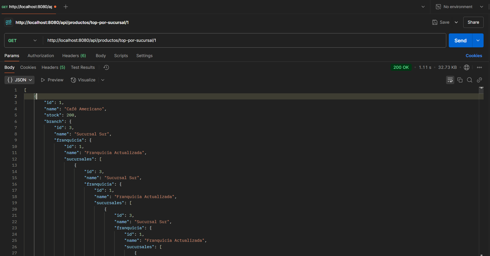

Borrar un Producto 
 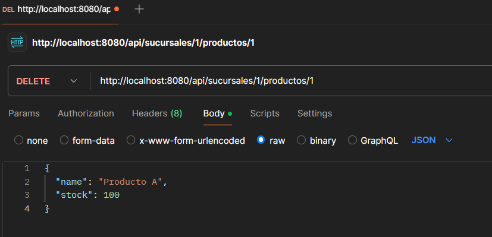

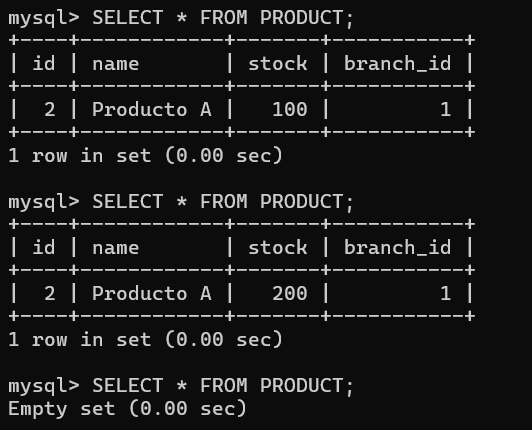

### IMAGEN EN DOCKER

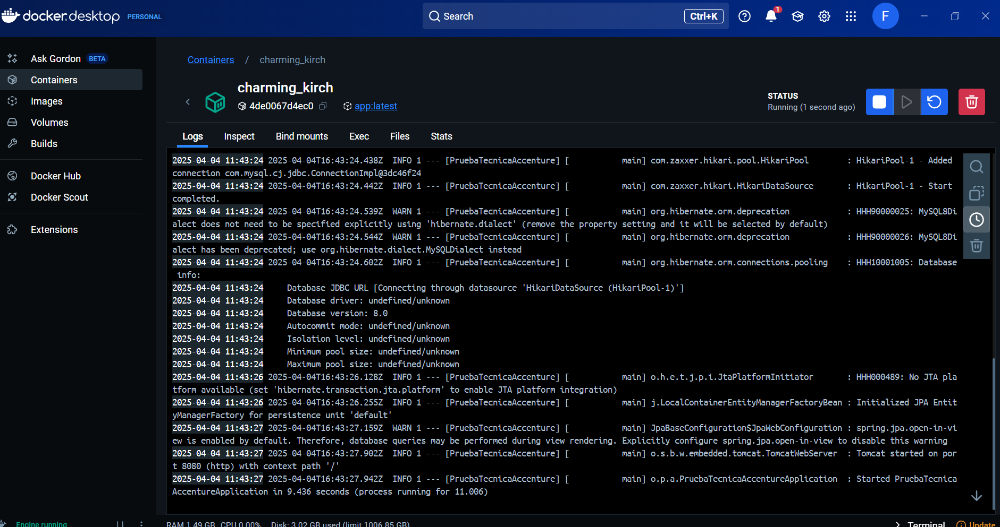

